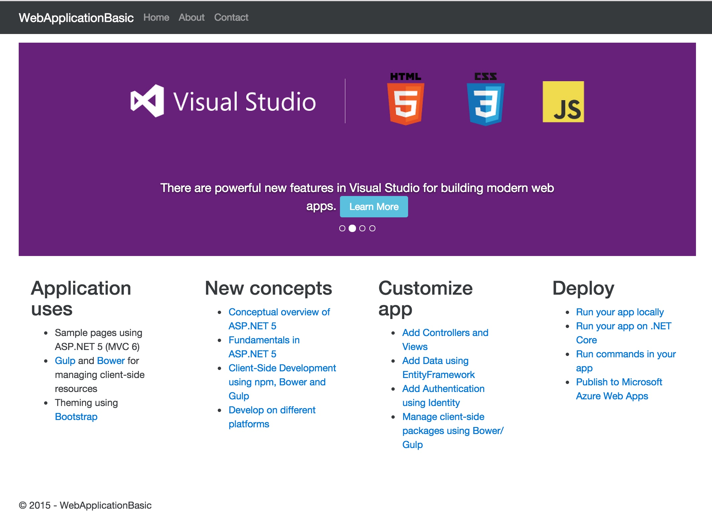
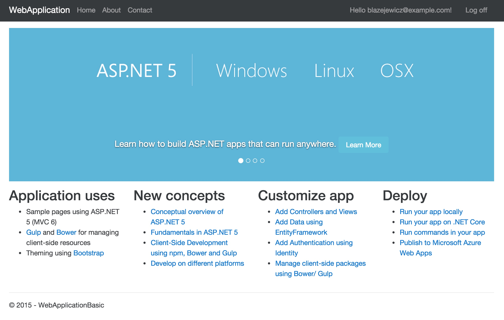

# [:construction:] .NET templates (aspnet/templating) with Bootstrap 4

In progress. The BS 4 landed, but not yet in your VS 2017.

Note that some content here is no longer applicable to a current aspnet/templating content (`Gulp`-ing no more?).

# ASP.NET 5 Bootstrap 4 (alpha)

The ASP.NET 5 web templates from @omnisharp/generator-aspnet updated for Bootstrap 4.

For ASP.NET 5 tooling team and for related projects.

## Web Application Basic

Take aways:
* update `Bower.json` dependencies
* use `Gulp` together with `projet.json` event scripts to execute `npm install` `bower install` and custom Gulp tasks for client side dependencies installation and optimization
* update `_Layout.cshtml` `link` and `script` tag helpers sources. Note that at moment the Microsoft Ajax CND does not support Bootstrap 4 yet - while Bootstrap CDN service does
* remove `Bootstrap Touch Carousel` together with `Hammer.js` dependencies - as `Bootstrap Touch Carousel` is no longer actively developed and maintained
* update `navbar` component structure as per BS4
* update `carousel` component structure as per BS4
* consistent use of `btn-primary` for primary action on forms



## Web Application

This is still WIP

Take aways:
* update `Bower.json` dependencies
* use `Gulp` together with `projet.json` event scripts to execute `npm install` `bower install` and custom Gulp tasks for client side dependencies installation and optimization
* update `_Layout.cshtml` `link` and `script` tag helpers sources. Note that at moment the Microsoft Ajax CND does not support Bootstrap 4 yet - while Bootstrap CDN service does
* remove `Bootstrap Touch Carousel` together with `Hammer.js` dependencies - as `Bootstrap Touch Carousel` is no longer actively developed and maintained
* update `navbar` component structure as per BS4
* update `carousel` component structure as per BS4
* update `form` tag helper: no `form-horizontal` required
* update `form-group`: add `row` class as there is no mixin for `form-group` now
* create correct `label` + `input` BS4 component using below code:
```cshtml
<label asp-for="RememberMe">
  <input asp-for="RememberMe" />
  @Html.DisplayNameFor(m => m.RememberMe)
</label>
```
The code will change after MVC TagHelpers are upgraded to support more features. For now the code needs to use standard Razor C# code (which is ugly)
* The `jquery-validation` has been updated to version `1.14.0`. It has different distribution files structure similar to `jQuery`



## Author

@peterblazejewicz
