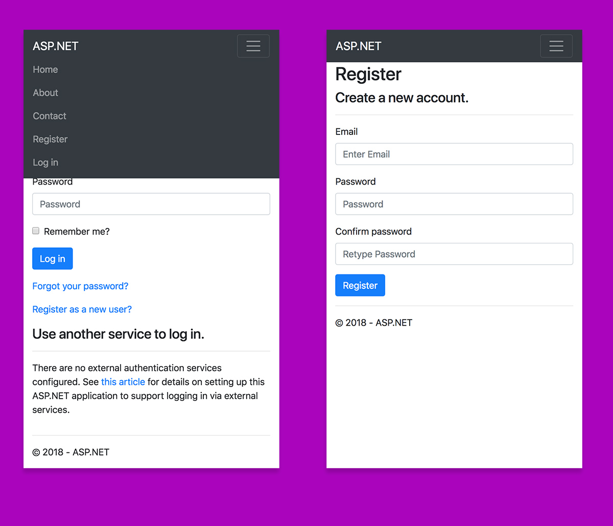

> HEADS-UP: MS did it! You need 2.1/2.2 dotnet SDK based templates You no longer needs this one

# .NET templates (aspnet/templating) with Bootstrap 4

> Hey, there is ongoing work on the ASP.NET repo to upgrade the ASP.NET templates to BS4: https://github.com/aspnet/Templating/pull/595

Very Much In Progress. The BS 4 has landed, but not yet in your VS 2017 and there is no current plan to change this AFAIK.

Note that some content here is no longer applicable to a current aspnet/templating content (`Gulp`-ing, `Bower`-ing no more, what's up with updates folks?) before the sample is fully rewritten.

## ASP.NET 5 Bootstrap  4

This is work in progress. The template comes with assets already in place and updated, but the markup of detail pages needs a review.

### TODO

- [x] figure out the general assets update
- [x] update Bootstrap assets to version 4
- [x] update jQuery to version 3.*.*
- [x] Popper.js included
- [x] update jQuery-Validate plugin
- [x] update jQuery unobstrusive-validation plugin
- [x] update general template markup to match Boostrap 4 changes
- [x] simplify general template
- [x] Font Awesome 5
- [x] bundling with Bundler/Minifier
- [x] FontAwesome web fonts support with assets `copy-on-build` support
- [x] bundler `.js` and `.css` ship with minified version and source maps
- [ ] subpages and subtamplates rewrite and update

## Author

@peterblazejewicz
